build-lists: true

# an engineers history 

### John Goulah (@johngoulah)

---

^ so this is a weird thing because I actually love working here

^ https://www.etsy.com/shop/bysol

---

# Why??

^ also why do I want to leave a stable company ?

^ here are three reasons...

---

^ Miyamoto Musashi - a 17th century twin sword fighting Samurai.

^ "Do not develop an attachment to any one weapon or any one school of fighting."

---

---

^ have seen the company go from 80 to 800+

^ https://www.etsy.com/listing/215833878/spiegelau-ipa-glass-life-is-short-drink

---

# Things I love

### (about etsy)

---

## Etski
### (Rip)

---

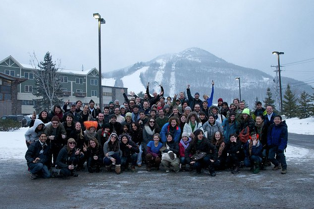

---

^ https://www.etsy.com/listing/253588185/ms-bettys-original-bad-ass-scented-soy

---

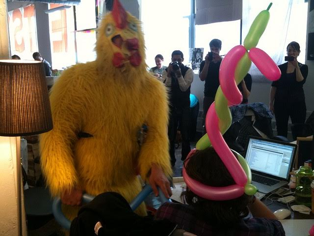

---

---

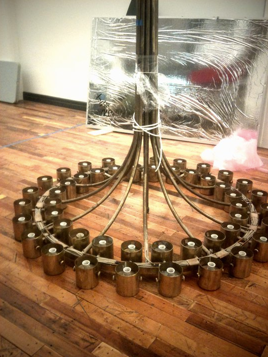

^ wtf lamps (tell story about kalin asking for help)

---

---

---

## Eatsy!

---

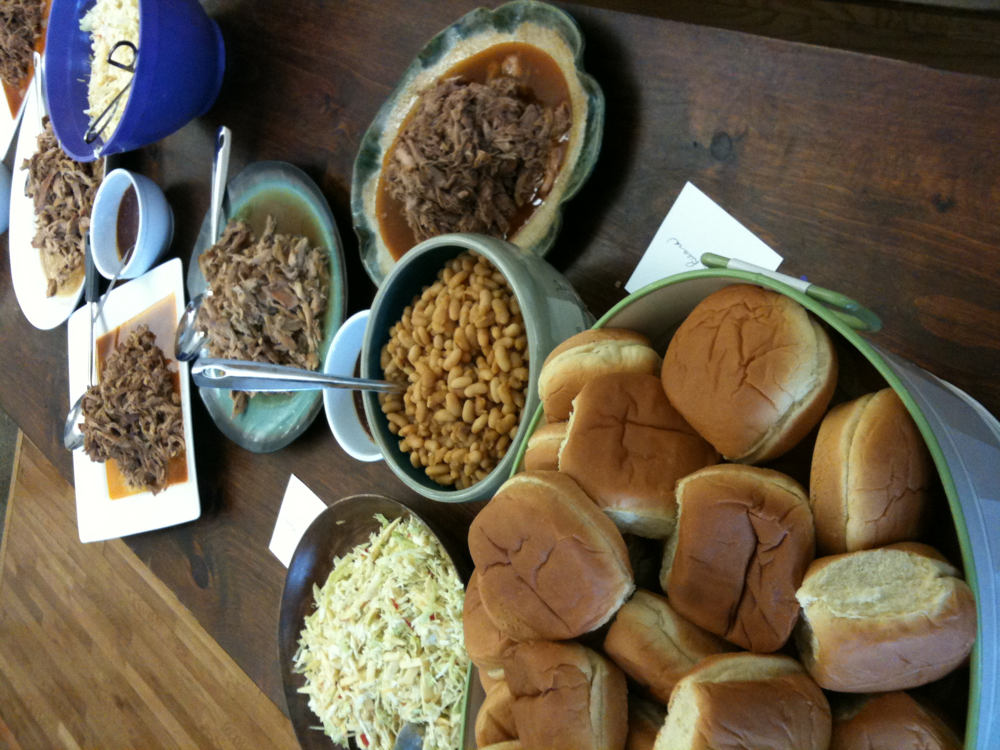

^ sept 2010

---

---

---

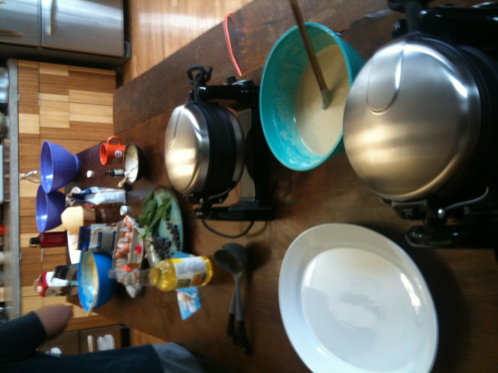

^ sept 2010

---

## Hack Week!

---

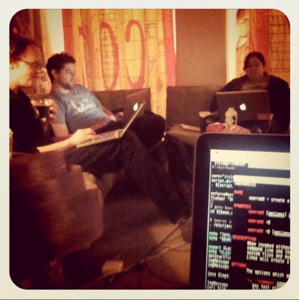

^ Tuesday April 5th 2011

^ exactly one year after i started

---

---

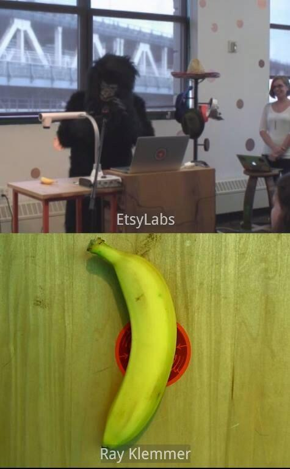

---

---

---

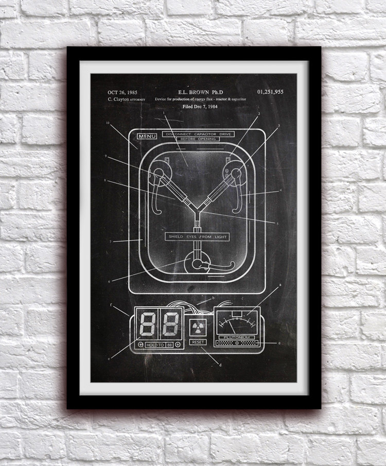

# Going back in time...

^ https://www.etsy.com/listing/225128020/flux-capacitor-back-to-the-future-action

---

---

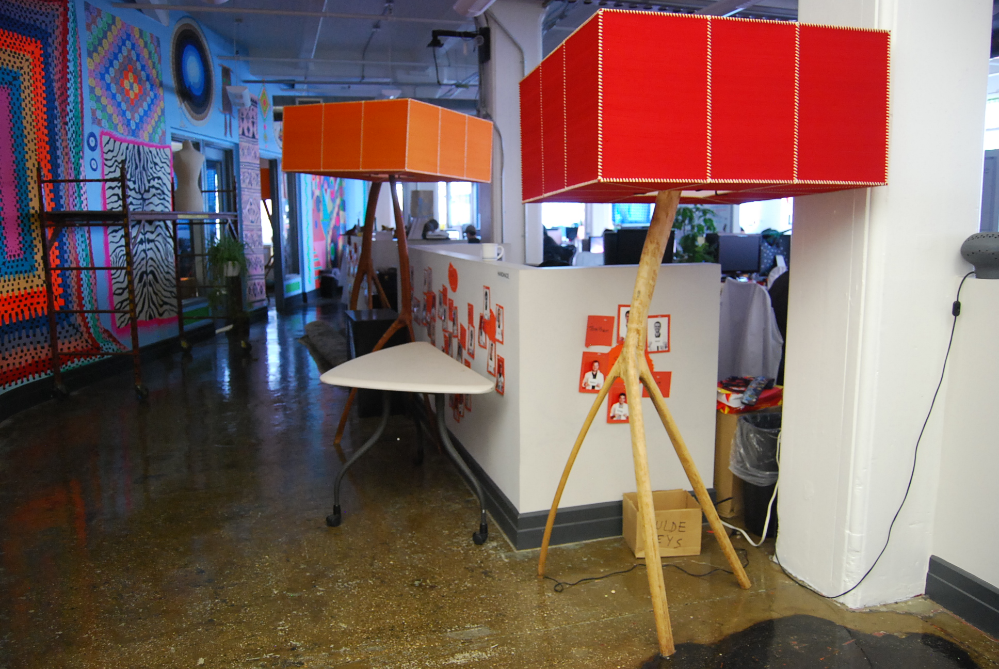

---

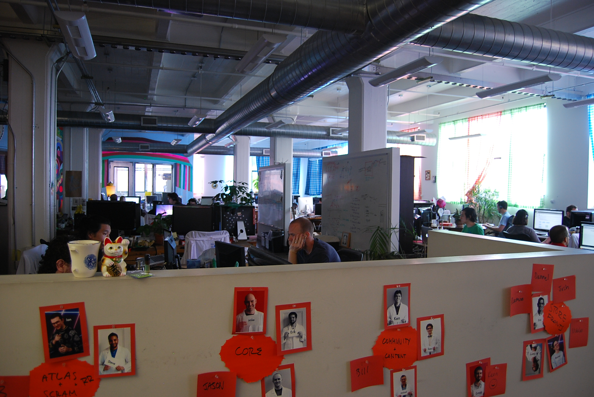

---

---

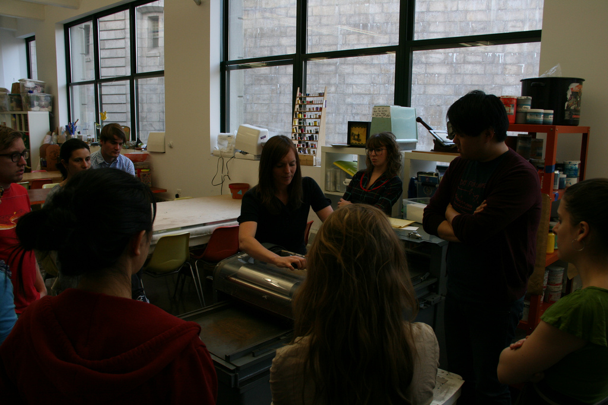

---

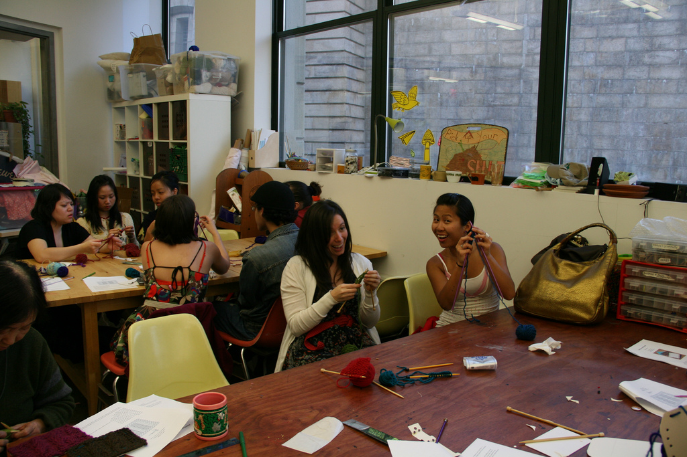

---

---

---

# Some Engineering History

---

## chbranch

^ cli wrapper that did a bunch of crap (some put things in weird states)

^ totally synchronous, can only load dev web site OR run tests

---

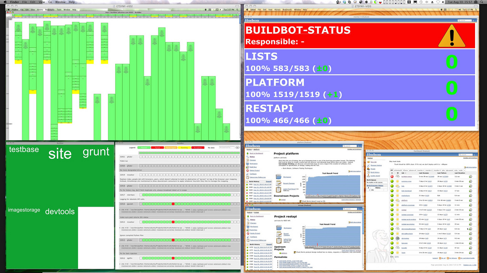

# Buildbot

---

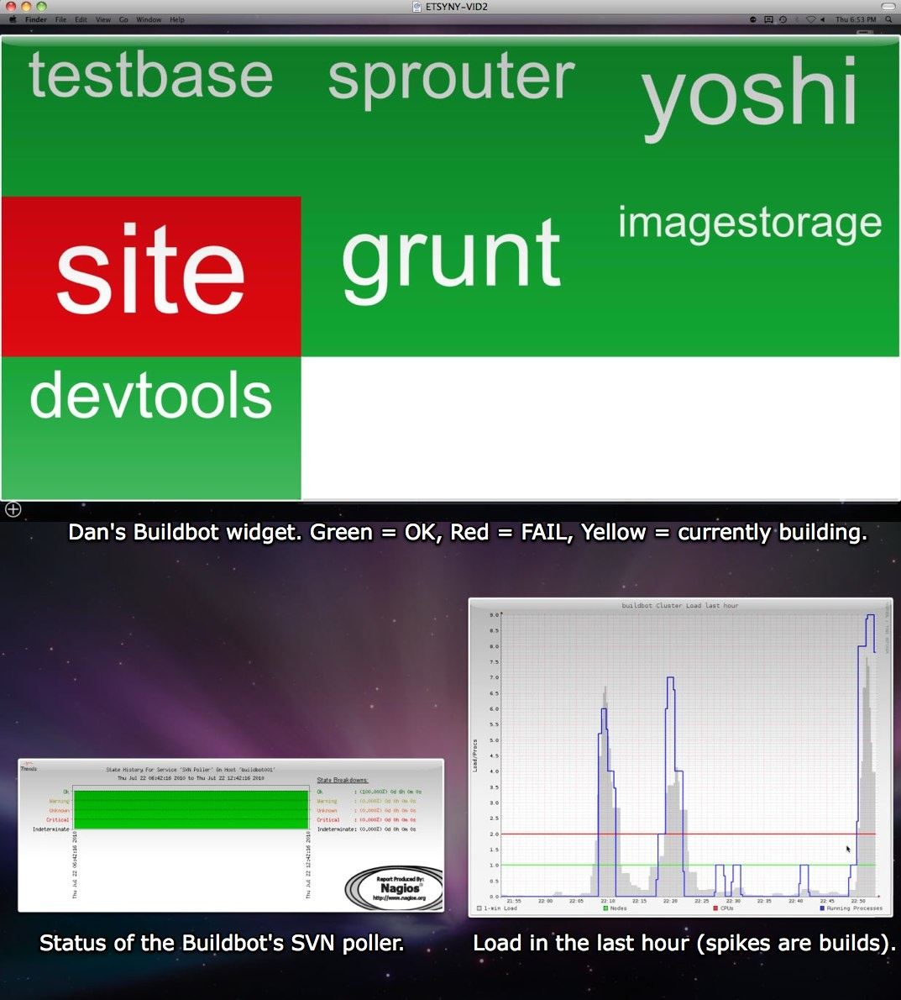

^ this was an example of our monitors (oct 2010)

---

# #push

^ push was a thing but no topic or coordination, sometimes not even talking, just triggering pushes, mostly bot chatter

---

# developer vm's

^ all the vm’s on one machine (100 vm’s) 

^ hand rolled (create dns entries manually, run some janky script, do more manual stuff, etc)

---

# Slow Evolution

^ https://www.etsy.com/listing/162827113/modern-abstract-painting-evolution

---

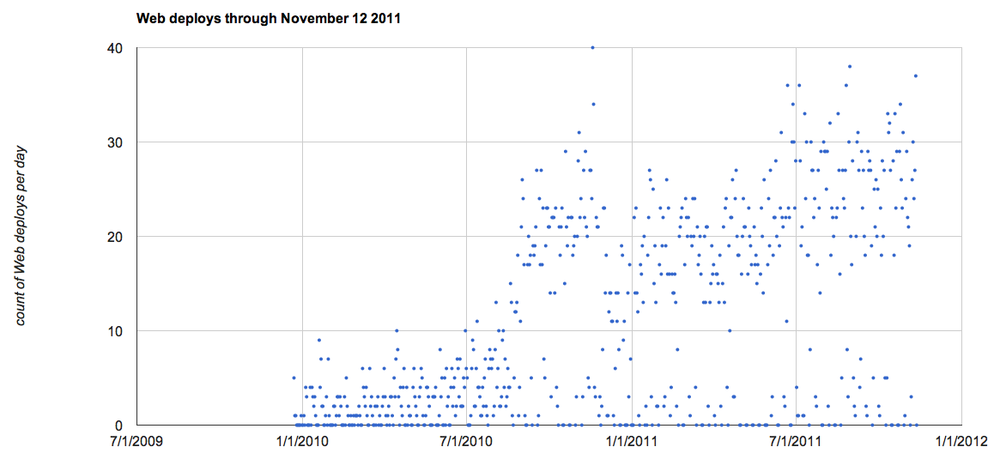

---

## Using #push topic to coordinate

^ soon pushbot thanks to asm, just appeared one day

---

# Deleted buildbot tests

^ introduced "hudson" (now jenkins) 

--- 

# supergrep

^ first iteration, chad, etc

---

# SVN to Git

---

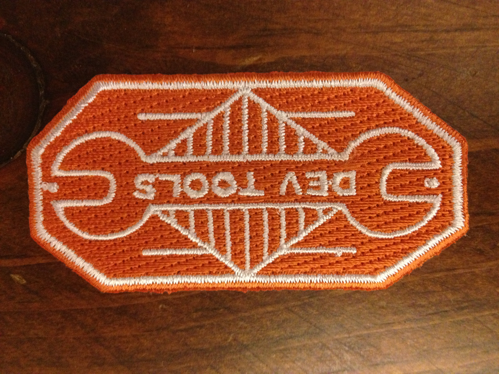

---

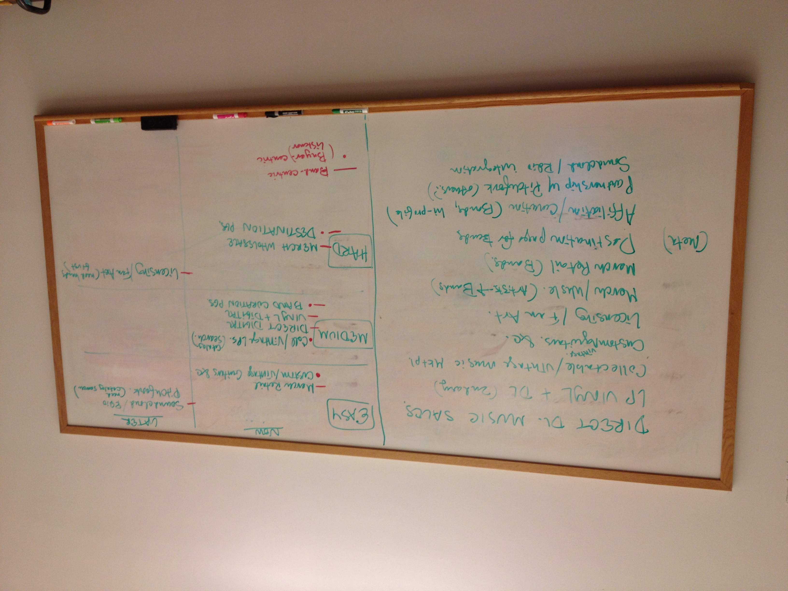

---

---
