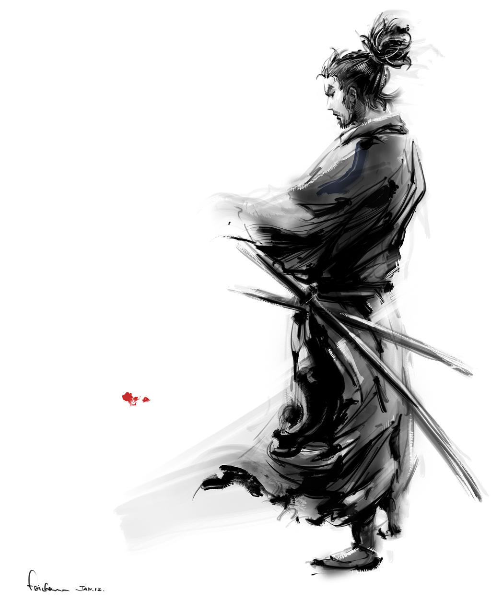
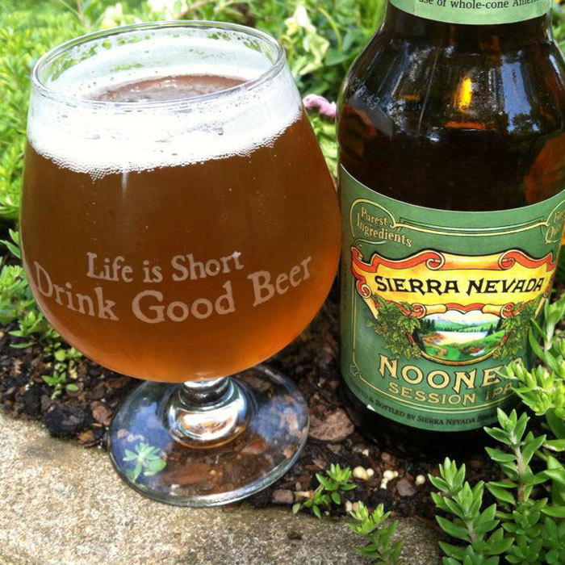
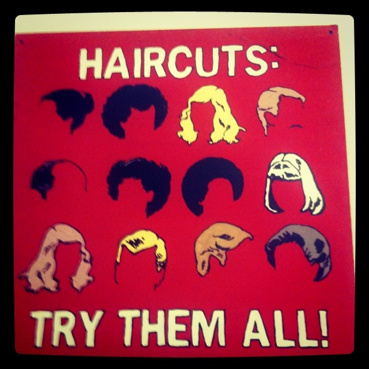

build-lists: true

# all the things 

### John Goulah (@johngoulah)

^ things, a title, a talk 
^computers, crochet, and craft
^ all the things I didn't do and more 

---

^ so this is a weird thing because I actually love working here

^ https://www.etsy.com/shop/bysol

---

# Why??

^ also why do I want to leave a stable company ?

^ here are three reasons...

---

^ Miyamoto Musashi - a 17th century twin sword fighting Samurai.

^ "Do not develop an attachment to any one weapon or any one school of fighting."

---

---

^ https://www.etsy.com/listing/215833878/spiegelau-ipa-glass-life-is-short-drink

---

# Things I love

---

## Etski
### (Rip)

---

---

## Keep it Weird

---

---

---

^ wtf lamps (tell story about kalin asking for help)

---

---

---

## Eatsy!

---

^ sept 2010

---

^ sept 2010

---

## Hack Week!

---

^ Tuesday April 5th 2011

^ exactly one year after i started

---

---

---

---

---
