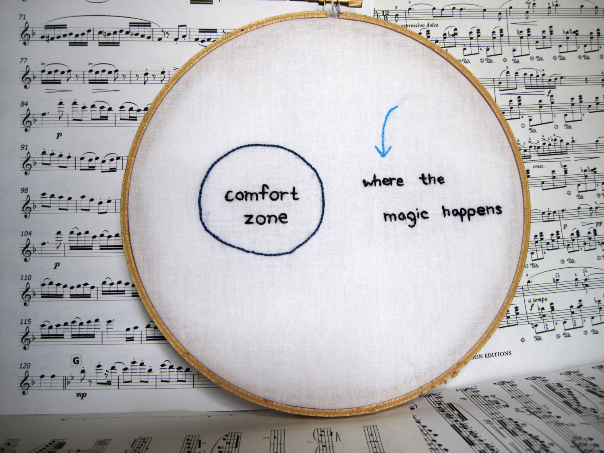
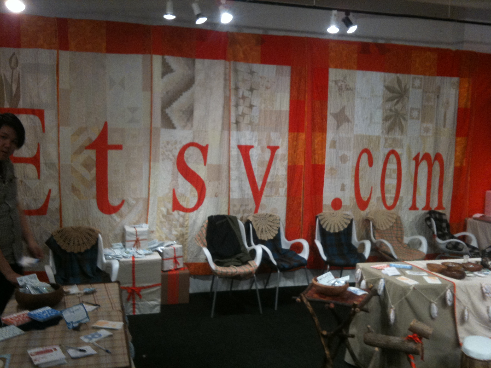
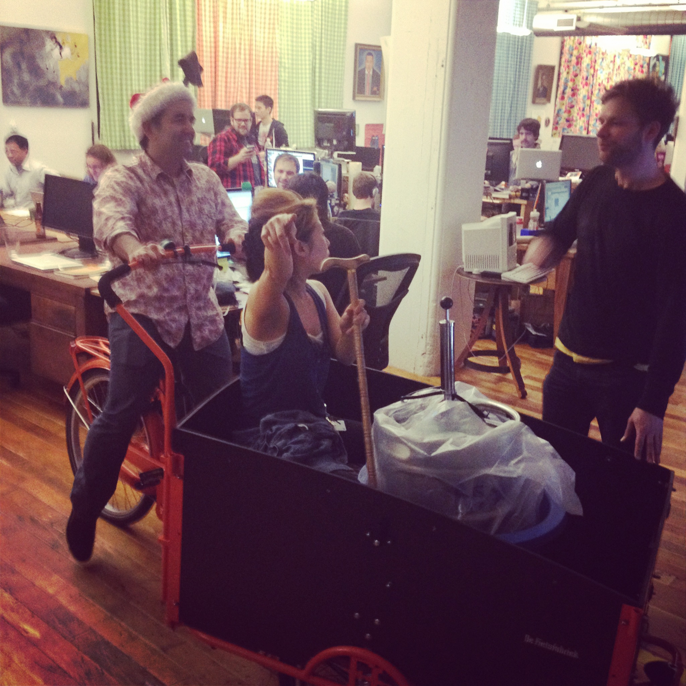

build-lists: true

# things, a title, a talk 

### John Goulah (@johngoulah)

^ things, a title, a talk 
^ all the things I didn't do and more 

---

# Why??

^ so this is a weird thing because I actually love working here

^ why do I want to leave a stable company ?  

---

^ "Do not develop an attachment to any one weapon or any one school of fighting." Miyamoto Musashi a 17th century twin sword fighting Samurai.

---

---

---

^ https://www.etsy.com/listing/215833878/spiegelau-ipa-glass-life-is-short-drink

---

---

^ sept 2010

---

^ wtf lamps (tell story about kalin asking for help)

---

^ sept 2010

---

---

---

---

---

---

---

---

---
