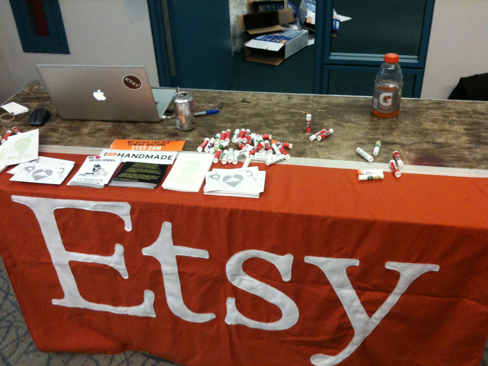

build-lists: true

# some things about etsy

## an engineers history

### John Goulah (@johngoulah)

---

^ best place i've worked (and have worked at quite a few), love the people, culture

^ so why leave?

^ https://www.etsy.com/shop/bysol

---

^ have seen the company go from 80 to 800+

^ 10 years in NYC, 6 at etsy (means I really liked this job)

^ https://www.etsy.com/listing/191374575/snifter-glass-life-is-short-drink-good

---

^ started wondering if I was too comfortable

^ https://www.etsy.com/listing/190390239/the-magic-happens-outside-of-your

---

^ Miyamoto Musashi - a 17th century twin sword fighting Samurai.

^ "Do not develop an attachment to any one weapon or any one school of fighting."

^ move around to different projects/groups as much as possible

^ i have to see what else is out there, how the world has changed

---

# Things I Love

### (about etsy)

---

## Etski
### (Rip)

---

---

^ https://www.etsy.com/listing/253588185/ms-bettys-original-bad-ass-scented-soy

---

---

---

^ wtf lamps (tell story about kalin asking for help)

---

---

^ halloween 2010

^ parties in office

---

## Eatsy!

---

^ sept 2010

---

---

# today

^ finely tuned machine, thanks krose and team

---

## Hack Week!

^ things I love!

---

^ Tuesday April 5th 2011

^ exactly one year after i started

---

---

^ hack week 2014

---

---

---

# Going Back in Time...

^ https://www.etsy.com/listing/225128020/flux-capacitor-back-to-the-future-action

---

---

^ no wooden floor, lamps everywhere, partitions

---

^ (video at end)

---

---

^ random craft night

---

^ hackathon

---

^ craft fairs

---

# Some Engineering History

^ from an infrastructure perspective

---

## chbranch

^ cli wrapper that did a bunch of crap (some put things in weird states)

^ totally synchronous, can only load dev web site OR run tests

---

# buildbot

^ pretty much always failing

^ there was a command ,rebuildreds

---

^ this was an example of our monitors (oct 2010)

^ sprouter - another piece of technology that we should pretend never happened

---

# #push

^ push was a thing but only bots, the conversation was all in #hardware

^ we didn't move to using push for talking to each other, or using the topic or pushbot until later

---

^ early deployinator (invented by kastner, as a lot of this stuff was)

---

# developer vm's

^ all the vm’s on one machine (100 vm’s)

^ hand rolled (create dns entries manually, run some janky script, do more manual stuff, etc)

^ all ran off chef solo, completely separate codebase (no shared code with production)

^ home dir mounted on NFS mounted with root_squash option (which prevents you from using root)

---

# Slow Evolution

^ brought in to work on API but started working more and more on our deploys and tools

^ https://www.etsy.com/listing/162827113/modern-abstract-painting-evolution

---

^ suddenly things started clicking, heres how that happened

---

## using #push topic to coordinate

^ started w/ push trains in the topic and status

^ soon pushbot thanks to asm, just appeared one day

---

# supergrep

^ really early on, logs spewing garbage, first iteration, chad, etc

---

# deleted buildbot tests

^ introduced "hudson" (now jenkins)

---

# autobots

^ autobots was born

^ fun fact: irc channel used to be called #untangle

---

# bobs

^ on the testing side the bobs were born

^ bobs are the virtual LXC containers that CI runs on

^ gave us the ability to run many try jobs and parallelize builds

---

^ wanted to unblock people from development hurdles

---

^ sept 23 2011

^ the team existed a bit before this, but this is when we standardized in a channel

---

# SVN to Git

^ one of first big projects, took about 6 months - a lot of work and restructuring the repo and training the org

^ this is what influenced using git rebase (rpull)

---

# virtual madness

^ first self serve internal cloud

^ across scalable cluster of physical hosts

---

# dev proxy

^ worked on a lot of database tooling, shard migrations, and schemanator for DDL changes

^ dev proxy probably the most interesting

---

---

# Music on Etsy

^ still think this is a good idea

---

# market expansion plans

^ 2012 (my attempt at the product world)

^ cross company thing, had to write proposal and present slides to exec team

---

^ wrote a detailed 13 page proposal if you are interested

^ russ, hersh, tim holley, justin s.

^ was not green lighted (but vintage cars was)

^ let me know when you want me to come back and work on music...

---

# Parting Thoughts 

---

# delete a meeting

^ yes, do it now, especially if its a 1:1 in a conference room

---

# sense of purpose

^ blog post by Kimber Lockhart on fostering sense of purpose over urgency

^ deep understanding of the reasons behind our efforts and a desire to pour in time and energy because that purpose resonates with the impact we’d like to make on the world

^ constant pressure to hurry reduces our ability to be proactive or creative

^ build in flexible time for cleanup, thinking, refreshing innovating

---

# move around a lot

^ don't get too comfortable, learn from people

---

# take risks

^ push yourself, don't settle for status quo

^ as a group try new things, new tech, get comfortable with R&D style iteration (mesos, cloud, etc)

---

# talk to people 

^ both inside and outside of the company

^ eng should increase the rate of communication with other orgs and be proactive

^ meet sellers, go to a craft fair, or a local meetup (host a home for the holidays)

---

# bike to work

^ its awesome

^ https://www.etsy.com/listing/150264935/bike-new-york-city-print-bike-art-print

---

^ concept originated in happiness hypothesis by jonathon haidt

^ humans have two sides, have to balance

^ An emotional/automatic/irrational side (the elephant)

^ An analytical/controlled/rational side (its rider).

^ Chip & Dan Heath - Switch: How to Change When Change is Hard

---

# Thanks!

### jgoulah@gmail.com

### @johngoulah

---

# bonus!!!!!!!!!!!!!!!!!!!!!!!!!!!!!!!!!!

---

---
